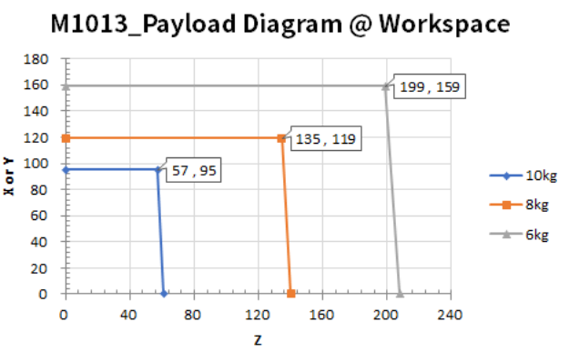
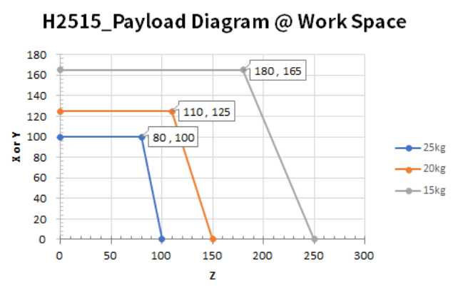
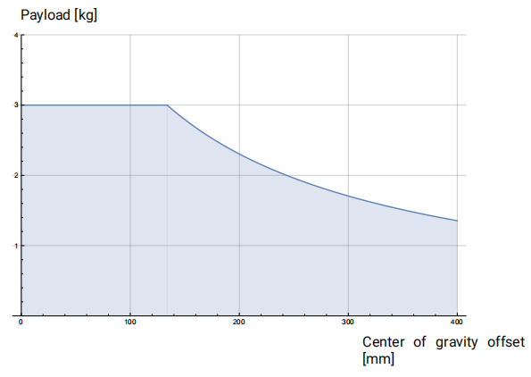
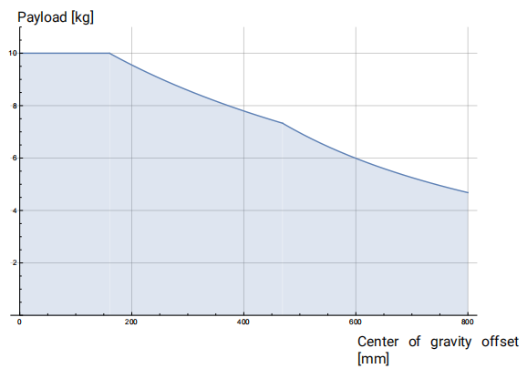
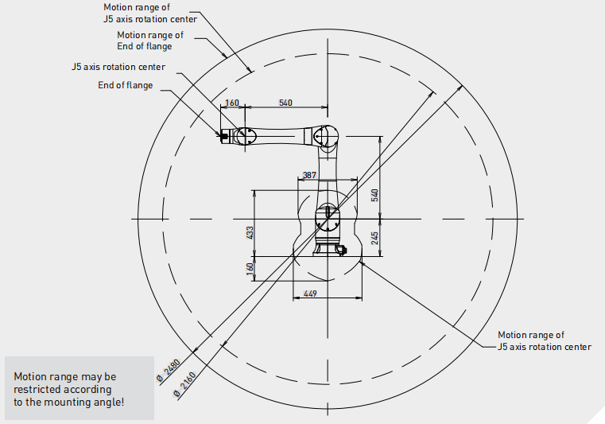

# Q1: Cobot Choice:
> What cobot would be best fitted for the client between the:
>
> a. Doosan M1013
>
> b. Doosan H2515
>
> c. UR3e
>
> d. UR10e
>
> e. CRX 10iA
>
> You can use robot payload, reach, ease of use and any other relevant features to justify your selection. (See documentation in the take-home folder)

## Decision:
Among the given robot choices, I would choose **Doosan M1013** based on comprehensive considerations of workspace&payload and some other aspects.

## Considerations:
1. **Workspace and Payload**:

    Regarding our task, **7kg** and **2m** range would require a medium-large size in category of cobot. Payload is NOT a const value, and it normally decrease when the robot extends outwards away from base.

    a. **Doosan M1013**: Doosan M series featured with built-in joint torque sensors for advanced control or safety. Within 8kg payload, it can cover R1.3m shperical workspace, which is quite ideal for this task.

    

    b. **Doosan H2515**: Doosan H series features with high power. Within 15kg, it can cover R1.8m shperical workspace. Since M1013 above is adequate for the given task, I would consider this one in other tasks which has higher requirements in workspace and payload.

    

    c. **UR3e**: with its maximum 3kg payload and 400mm reachable range, it fails in both requirements.

    

    d. **UR10e**: the reachable distance is less than required. Though the radius of workspace is noted 1300m, it decreases to 500mm when the payload reach 7kg. Thus, unforturnately, it does not match well with this task.

    

    e. **CRX 10iA**: this robot does not provide a payload-workspace chart as other candidates.Its wrist reachability range 2160mm has just cover 2m requirement. However, as the robot will be in collaped configurations during task, it is possible to fail in the application and needs to be verified. Meanwhile, its maximum payload (10kg) may drop under 7kg referring to the payload-workspace of UR10. It would be very risky to choose CRX-10iA robot without further validation. Besides, I do find enhanced version [CRX-10iA/L](https://cdn.craft.cloud/de5c9867-3359-4b96-a477-341c1d3661b3/assets/files/data-sheets/crx-10ia-l-data-sheet_2024-05-23-173351_ezdn.pdf) with larger reachability(1418mm). But it is out of scope of the options.

    

2. **Ease of use**:

    All the robot candidates are easy to use in general. They all come with an easy installation and neat cable connections, etc. They all have user friendly teach pandent to config or manipulate the arm. They all come with control box to easily integrate with external I/O or safety componnets. I would just list out two aspects regarding to "Ease of use" below:

    a. **user interface**:
      - The Dart Suite of Doosan provides an convenient way for developement and operation, as well as a sharing community in Dart store. It is a great asset that user can customize the HMI interface for tasks. In addtion, the cockpit button and led lights on the wrist are very similar to Franka Panda robot, and these are very convenient for testing and development as well.
      - The user interface of UR robots impressed me when they released UR5 many years ago, but I didn't see much changes after these years. The teach pendant menu and urscript are still simple and easy to use, but other robots have made progress while it stays unchanged. The UR robot offers constrained freedrive mode which is quite helpful, but if there could be a button on the wrist would be more convenient. It worths to mention that URCap is a great feature and has a good community to share knowledge.
    - CRX-10iA has a modern and friendly interface in a control tablet, which is much better than Fanuc's old style (pressing buttons on the control panel). The programming by dragging icons is very convenient for some simple and fast tests.

    b. **software development**:

    As our task can be achieved by position control, it is generally the most basic funciton the api would provide. Some other tasks may require velocity control, or even torque control to cobots, and certain cobots support these modes(eg: kinova gen2/3, kuka iiwa 7/14) by default.

    Since we prefer to use ROS as the middleware for development, for both UR and Doosan, they have official support for ROS1 and ROS2([ur-ros1](https://github.com/UniversalRobots/Universal_Robots_ROS_Driver), [ur-ros2](https://github.com/UniversalRobots/Universal_Robots_ROS2_Driver), [doosan-ros1](https://github.com/doosan-robotics/doosan-robot), [doosan-ros2](https://github.com/doosan-robotics/doosan-robot2)). Fanuc officially provided ROS1 package only([funac-ros1](https://github.com/ros-industrial/fanuc)), though you may find ROS2 from third-party([university of Idaho](https://github.com/UofI-CDACS/fanuc_ros2_drivers), [ARM Lab](https://github.com/paolofrance/ros2_fanuc_interface?tab=readme-ov-file)). This could be a consideration if we are using ROS2 for project development.

    It is worth to mention that, though some ros packages are provided by the company, it is not always necessary to use the whole package. For certain cases, we develop our own control system and simulation tools, only the low-level communication layer is needed in such case.

3. **Other aspects**:

    I'll certainly consider other important aspects when choosing a robot for an application. Checking all details would require more time than I currently have, so I would provide my considerations in these aspects in general cases.

    a. **Precision**: Repeatability and (calibrated) accuracy would be an consideration in some precision tasks.

    b. **dexterity**(DoF): Less DoF may lower the cost, while high DoF provides more dexterity in manipulation. With a 7Dof arm, it can easily pass typical sigularity configurations for 6Dof arms, while optimize other features in its nullspace.

    c. **Dynamic features** (speed, acceleration, torque): When dynamics (eg: tossing task, non-prehensile manipulation while working in Tencent) or time is important, dynamic features should be considered.

    d. **Maintenance, community and support**: These are some quite practical aspects in the long run with the project. UR stands well in these fields.

    e. **Cost**: There are always more great products to explore than the limited budget.

    f. **Safety**: Many cobot manufactors annouced that their product is safe to human robot collaboration. However, official slogons is not always reliable. For example, our lab once evaluated the [safety impact of UR robot](https://www.youtube.com/watch?v=g-MsVHFfNGc), and concluded it is not that *safe*. Doosan M1013 would stop when it hits human, but I won't conclude it is *safe* before conducting a throughout test.

# Q2: Gripper Choice:

## Decision:
Based on the following considerations, I would choose **VG10**, **RG2** and **quick change** from **OnRObot** for the given task.

## Considerations:
1. **Variation of workpieces**:

    The two workpieces are quite different in the dimention and weight:

    - carboard box: 300mm x 400mm x 300mm, 7kg

    - wooden cube: 40mm x 40mm x40mm, 0.5kg

    To handle both workpieces properly, it generally requires two different EoATs(End-of-Arm-Tool). I would prefer to use vacuum gripper for the carboard box for a wide coverage and payload, and a two finger gripper for the wooden cube for potiential dexterous operations on small workpieces.

2. **Tool change requirement**:

    The client is "open to gripper change over different workpieces, easy and toolless". In most cases, the change of EoAT may requires some manual operations, such as the change of flange, etc. However, with *quick changer system*, the change of EoATs may be realized *toollessly* (eg: [Schunk quick change system](https://schunk.com/ca/en/automation-technology/change-systems/sws/c/PGR_1135)). It is more intuitive and compatible to have quick change system and grippers from the same company.

3. **Justification of choice**

    Though the gripper is open to any choice, I can find a proper solution from the provided documents straight forward.

    [VG10](https://onrobot.com/sites/default/files/documents/Datasheet_VG10_EN_0.pdf) is chosen for the carboard box because:
    - Payload up to 15kg (vacuum gripper always recommend to over the requirement for potiential vibration, leaking, etc.)
    - Unfolded mode can be adjusted to cover 136x346[mm] surface, which is perfectly align with the carbon box, providing an evenly distributed lifting.
    - I really like its design. It is very flexible and practical to adapt different requirements.

    [RG2](https://onrobot.com/sites/default/files/documents/Datasheet_RG2_EN_0.pdf) is chosen for wooden cube because:
    - Payload 2kg and stroke 110mm fit just well with the task
    - The parallel fingers can fit the cube surpace very well, providing a very stable grasp with form-closure and force-closure. It has high resistance to disturbances, collision, etc.
    - It can share the same [quick change from OnRobot](https://onrobot.com/en/products/quick-changer), to meet the *toolless* requirement.

# Q3: Calibration procedure:
## Proposal:
I would propose to use OptiTrack cameras [Prime 13W](https://optitrack.com/cameras/primex-13w/) if the budget agrees.

The procedure is quite easy and straight forward:
- calibrate the camerasystem if the first time or installation of the camera is changed
- attach numerous reflective markers along the edges of the table and robot base, and create the object in the OptiTrack system
- read the frame attached(defined) to the tables directly from API whenever needed. In general cases no other operations are needed after moving tables or robots

My proposal assumes this workspace is the prototyping area or lab, where various projects may be developped or tested. I appended reasons in "Consideration" section, as well as some comments on other methods based on my previous experience.

For other circumstance, such as a temporal project, the proposal may vary with the considerations mentioned below.

## Considerations:
I have used several equitments/methods for robot calibration in the past, including Opti-Track, Vicon system, Faro Laser, Faro Arm, HandyProbe&C-Track, Acuro Vision, etc. They are preferable for different use cases. Since it's not possible that the assignment description cover all circumstance of the real case, the proposal may vary with the considerations mentioned below.

a. [OptiTrack](https://optitrack.com/cameras/)
- It is convenient to have the camera solution cating for different volume of workspace, without losing accuracy. The postion result is around 0.3mm in 9meter distance, which is sufficient for most application.
- It is capable to track objects in realtime at the rate from 240FPS to 1000FPS, which allows the system for dynamic applications, eg: pick&place on mobile tables, human motion tracking, track flying objects, etc.
- The system calibration, creatation of object in the system is easy.
- I have established the motion capture system with Prime 17W, Prime 13W and Flex 13, and receive positive feedbacks.

b. [Vicon](https://www.vicon.com/hardware/cameras/)
- Vicon system is very similar to OptiTrack regarding to the setup, procedure and performance, can be considered as an alternative.
- The stability was not as good as OptiTrack based on our experience. This part is a bit tedious to write, so we can discuss the details next time if interested

c. [Faro Laser Tracker](https://www.faro.com/en/Resource-Library/Tech-Sheet/techsheet-faro-vantage-s6-e6-laser-trackers)
- It can measure up to 35m, with resolution under micrometers. It is ideal for precision tasks, such as kinematic calibration of robot manipulators
- The installation is very simple and mobile, though the measurement may takes few steps but still very easy and fast, obtaining position of each SMR (sperically mounted retro reflector)
- A simple script may needed for each object with dedicated location of SMRs, which is cannot be resuded directly on new projects.
- *I may pick this solution* if the installation mobility is required, no camera can be installed on the wall or ceiling, it's just for temporally use, etc.

d. [Faro Arm](https://www.faro.com/en/Products/Hardware/Quantum-FaroArms)
- It is another tool ideal for high presition measurement, and I used it for manipulator calibration before.
- The installation is not very friendly, and it requires more time to collect data.
- It's workspace is relatively small, so it is not an option for the given project.

e. [Creaform HandyProbe](https://www.creaform3d.com/en/metrology-solutions/coordinate-measuring-machines-handyprobe/technical-specifications)
- HandyProbe and C-Track combination provides accuracy around 0.03mm, with measurement up to 6meters
- It is usually for part inspection, and we used it for simple calibration as well since essentially they are computation based on measurements.
- The procedure is similar to *Laser Tracker*, measuring points on object individually and write a script to obtain object position.

f. [ArUco Markers](https://github.com/pal-robotics/aruco_ros)
- *I would pick this solution* if budget is very limited, and precision requirement is low.
- After install a RGB camera above and find *good* place for ArUco makers, there's nothing to do after moving the tables. You can read table's position anytime from opencv api or ros packages provided above.
- There are other fiducial markers, such as AprilTag, STag, etc. Personally, I mostly use ArUco and it gives good result in general.

# Q4: Restrictions and internal safeguards(Optional):
Most cobots have some built-in restrictions and internal safeguards that increase the safety when working alongside with human. Some most common features are:

a. **Force and torque sensing**: Some cobots are equipped with force/torque sensors to detect collisions. I have been involved in the development of collsioin detection algorithm in a medical manipulator. Other than simply setting a threshold, there are other advanced methods can estimate collision location, and seperate collsition from EoAT working force based on nullspace projection, etc.

b. **Current or Power monitoring**: Some cobots has no force/torque sensors, will use current to estimate the joint torque. However, there are some drawbacks in this approach when we implement this method. Some robots also limit the overall power for safety.

c. **Speed monitoring and Limiting**: Speed information is genenrally observed in realtime, and it feeds to the safety module. Limiting the speed is a quite straight forward solution to safety issues. If hard-zone and soft-zone is customizable, different policies are applied to speed accordingly.

d. **Compliant joints or light links**: Certain cobot (eg: Baxter) has compiant joint design, while other robots(eg: kinova gen2) use carbon material to achieve ultra light for links. These features also contributes to the safe human-robot cooperation.

f. **External sensors**: I used vision system and radar for the safe human robot interaction of a chess robot project. With human(or hand) detetion and path planning based on dynamical system, the robot can behave smoothly and friendly with human.

With that been said, I would not gurantee the robot is *abosolute* safe due to several reasons. Even everything is working properly, and all users strictly follows the safety code, the norminal design of the robot might not be safe as well. An example is already discussed in the "Q1/Considerations/Other aspects/Safety".
